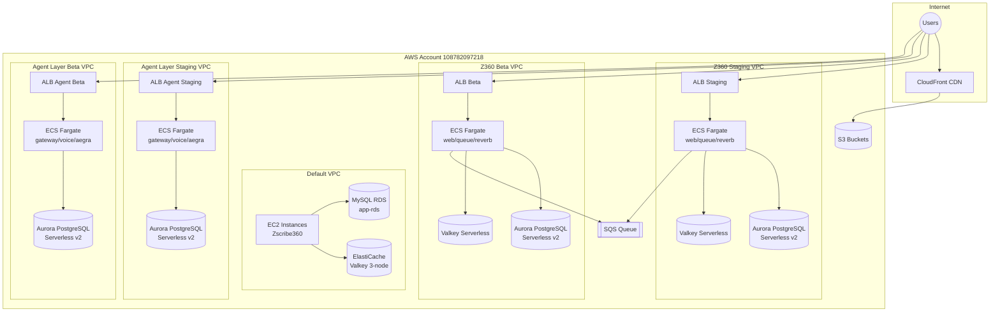
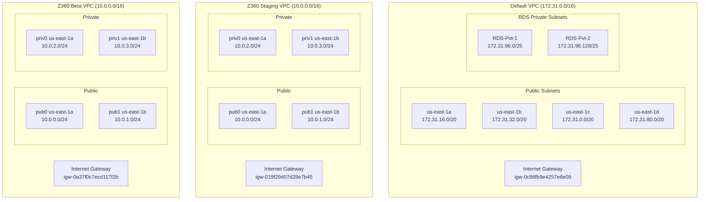
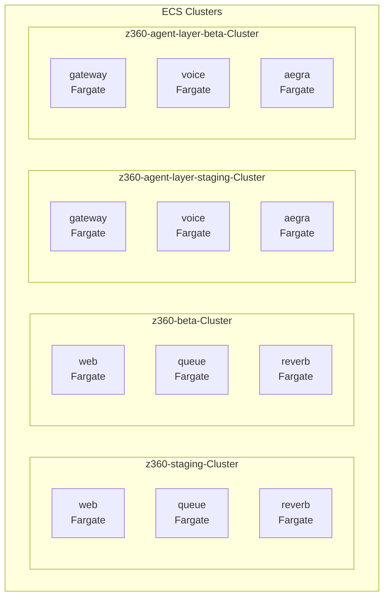
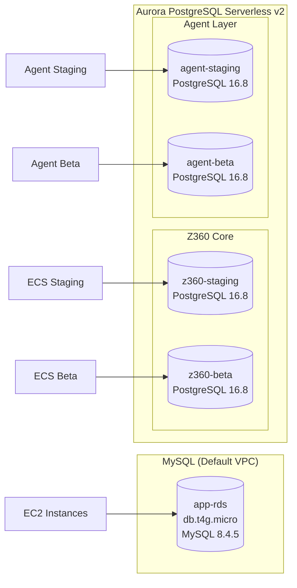
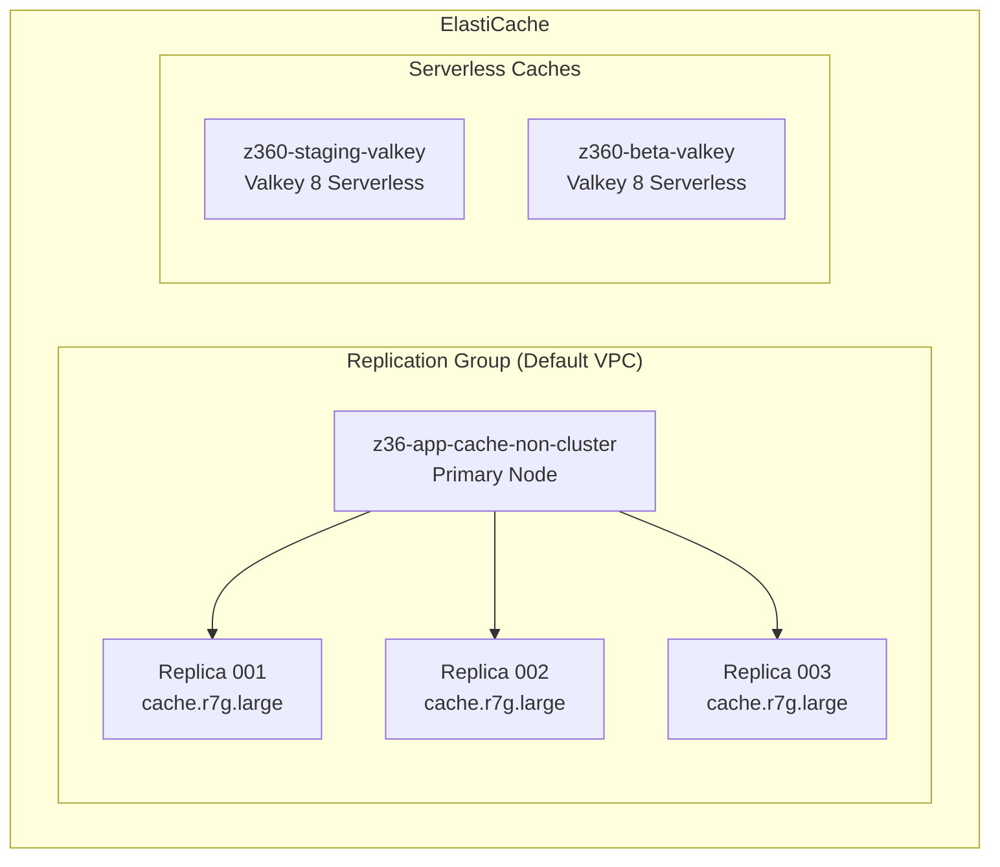
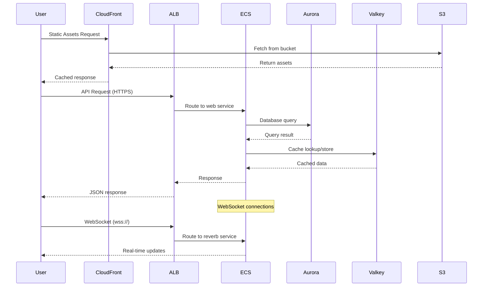
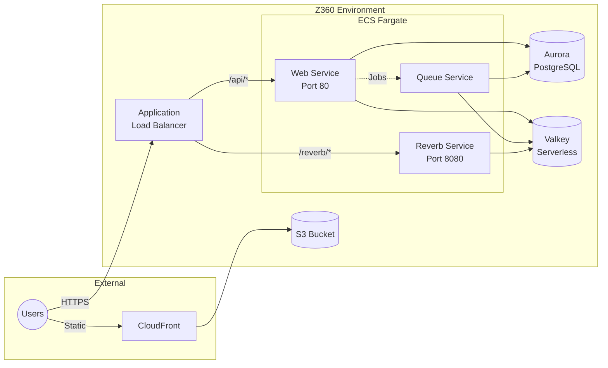
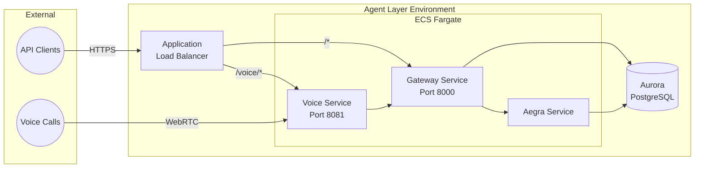
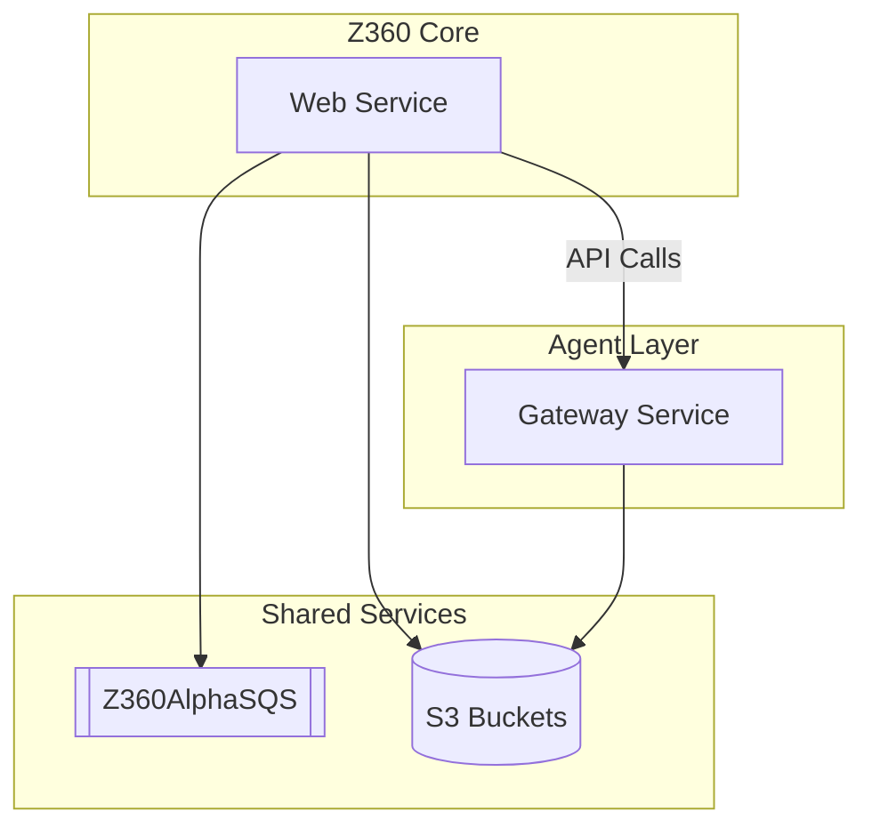
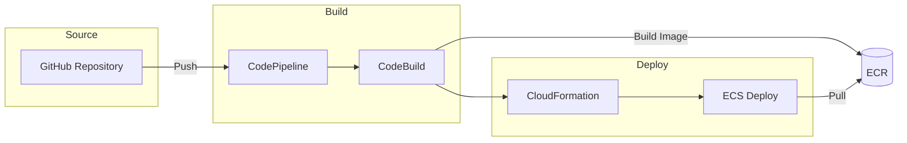

# Z360 AWS Infrastructure Audit

**Account ID:** 108782097218
**Primary Region:** us-east-1
**Audit Date:** January 14, 2026

---

## Executive Summary

The Z360 ecosystem is a multi-environment containerized application platform running on AWS. The infrastructure supports three primary workloads:

| Workload | Description |
|----------|-------------|
| **Z360 Core** | Main application with web, queue, and reverb services |
| **Z360 Agent Layer** | AI agent services with gateway, voice, and aegra components |
| **Zscribe360** | Transcription service running on EC2 |

The infrastructure follows a **staging/beta** environment pattern with isolated VPCs and dedicated resources per environment.

---

## Resource Inventory Summary

| Resource Type | Count | Status |
|---------------|-------|--------|
| EC2 Instances | 4 | 1 running, 3 stopped |
| ECS Clusters | 4 | All active |
| ECS Services | 12 | All running |
| RDS Instances | 5 | All available |
| Aurora Clusters | 4 | All available |
| ElastiCache Nodes | 3 | Replication group (Valkey) |
| ElastiCache Serverless | 2 | Staging + Beta |
| S3 Buckets | 9 | All active |
| CloudFront Distributions | 4 | 3 enabled, 1 disabled |
| Application Load Balancers | 5 | All active |
| Lambda Functions | 33 | Infrastructure management |
| VPCs | 5 | 1 default + 4 Copilot-managed |
| Route 53 Hosted Zones | 13 | 9 public, 4 private |

---

## High-Level Architecture



---

## VPC Architecture

### VPC Overview

| VPC Name | VPC ID | CIDR Block | Purpose |
|----------|--------|------------|---------|
| Default VPC | vpc-06fab8e58cd12e4a9 | 172.31.0.0/16 | EC2 instances, legacy RDS |
| copilot-z360-staging | vpc-065b29b166c7dcf63 | 10.0.0.0/16 | Z360 Core Staging |
| copilot-z360-beta | vpc-07f099e800d2490cc | 10.0.0.0/16 | Z360 Core Beta |
| copilot-z360-agent-layer-staging | vpc-01379062cfa09a891 | 10.0.0.0/16 | Agent Layer Staging |
| copilot-z360-agent-layer-beta | vpc-0adfa9e056db7d9b8 | 10.0.0.0/16 | Agent Layer Beta |

### Network Diagram



**Note:** All Copilot-managed VPCs follow the same subnet pattern (2 public + 2 private subnets across 2 AZs). No NAT Gateways are deployed.

---

## Compute Resources

### EC2 Instances

| Instance ID | Name | Type | State | Private IP | Public IP | Purpose |
|------------|------|------|-------|------------|-----------|---------|
| i-0dcea86e8744c74bc | Zscribe360 | t2.medium | **running** | 172.31.24.110 | 98.85.52.46 | Transcription service |
| i-0140a2d42c6e8c498 | Z360 Manager | t2.micro | stopped | 172.31.81.90 | - | Management console |
| i-0a65fe6e9b90743f8 | Z360 App | t2.xlarge | stopped | 172.31.18.68 | 52.202.217.179 | Legacy app server |
| i-08f8a3f5ecb1f61e1 | Z360 Queue manager | t2.xlarge | stopped | 172.31.29.209 | - | Queue processing |

All EC2 instances are deployed in the **Default VPC** (vpc-06fab8e58cd12e4a9).

### ECS Architecture



### ECS Services Detail

| Cluster | Service | Task Definition | Desired | Running | Launch Type |
|---------|---------|-----------------|---------|---------|-------------|
| **z360-staging** | web | z360-staging-web:151 | 1 | 1 | FARGATE |
| z360-staging | queue | z360-staging-queue:43 | 1 | 1 | FARGATE |
| z360-staging | reverb | z360-staging-reverb:5 | 1 | 1 | FARGATE |
| **z360-beta** | web | z360-beta-web:19 | 1 | 1 | FARGATE |
| z360-beta | queue | z360-beta-queue:16 | 1 | 1 | FARGATE |
| z360-beta | reverb | z360-beta-reverb:2 | 1 | 1 | FARGATE |
| **agent-layer-staging** | gateway | z360-agent-layer-staging-gateway:79 | 1 | 1 | FARGATE |
| agent-layer-staging | voice | z360-agent-layer-staging-voice:92 | 1 | 1 | FARGATE |
| agent-layer-staging | aegra | z360-agent-layer-staging-aegra:94 | 1 | 1 | FARGATE |
| **agent-layer-beta** | gateway | z360-agent-layer-beta-gateway:8 | 1 | 1 | FARGATE |
| agent-layer-beta | voice | z360-agent-layer-beta-voice:15 | 1 | 1 | FARGATE |
| agent-layer-beta | aegra | z360-agent-layer-beta-aegra:16 | 1 | 1 | FARGATE |

**Service Roles:**
- **web**: Main application server handling HTTP requests
- **queue**: Background job processing (Laravel queues)
- **reverb**: WebSocket server for real-time features
- **gateway**: API gateway for agent services
- **voice**: Voice processing and LiveKit integration
- **aegra**: AI agent execution engine

---

## Data Layer

### Database Architecture



### RDS Instances

| Identifier | Engine | Version | Instance Class | Status | VPC |
|------------|--------|---------|----------------|--------|-----|
| app-rds | MySQL | 8.4.5 | db.t4g.micro | available | Default |
| z360-staging-...dbwriterinstance | Aurora PostgreSQL | 16.8 | db.serverless | available | z360-staging |
| z360-beta-...dbwriterinstance | Aurora PostgreSQL | 16.8 | db.serverless | available | z360-beta |
| z360-agent-layer-staging-...dbwriterinstance | Aurora PostgreSQL | 16.8 | db.serverless | available | agent-staging |
| z360-agent-layer-beta-...dbwriterinstance | Aurora PostgreSQL | 16.8 | db.serverless | available | agent-beta |

### Aurora Clusters

| Cluster | Engine | Writer Endpoint | Reader Endpoint |
|---------|--------|-----------------|-----------------|
| z360-staging | aurora-postgresql 16.8 | *.cluster-clu88o4y4e7g.us-east-1.rds.amazonaws.com | *.cluster-ro-clu88o4y4e7g.us-east-1.rds.amazonaws.com |
| z360-beta | aurora-postgresql 16.8 | *.cluster-clu88o4y4e7g.us-east-1.rds.amazonaws.com | *.cluster-ro-clu88o4y4e7g.us-east-1.rds.amazonaws.com |
| agent-layer-staging | aurora-postgresql 16.8 | *.cluster-clu88o4y4e7g.us-east-1.rds.amazonaws.com | *.cluster-ro-clu88o4y4e7g.us-east-1.rds.amazonaws.com |
| agent-layer-beta | aurora-postgresql 16.8 | *.cluster-clu88o4y4e7g.us-east-1.rds.amazonaws.com | *.cluster-ro-clu88o4y4e7g.us-east-1.rds.amazonaws.com |

### Caching Layer



| Cache | Type | Engine | Version | Endpoint |
|-------|------|--------|---------|----------|
| z36-app-cache-non-cluster | Replication Group | Valkey | 8.0.1 | master.z36-app-cache-non-cluster.hbph82.use1.cache.amazonaws.com:6379 |
| z360-staging-valkey | Serverless | Valkey | 8 | z360-staging-valkey-hbph82.serverless.use1.cache.amazonaws.com:6379 |
| z360-beta-valkey | Serverless | Valkey | 8 | z360-beta-valkey-hbph82.serverless.use1.cache.amazonaws.com:6379 |

---

## Load Balancing & Traffic Flow

### Application Load Balancers

| Name | Scheme | DNS Name | VPC | Purpose |
|------|--------|----------|-----|---------|
| AppLoadbalancer | internet-facing | AppLoadbalancer-639088716.us-east-1.elb.amazonaws.com | Default | EC2 instances |
| z360-s-Publi-hdXAuvDlRXF6 | internet-facing | z360-s-Publi-hdXAuvDlRXF6-571871136.us-east-1.elb.amazonaws.com | z360-staging | Staging ECS |
| z360-b-Publi-VVFRqJywF53r | internet-facing | z360-b-Publi-VVFRqJywF53r-484439536.us-east-1.elb.amazonaws.com | z360-beta | Beta ECS |
| z360-a-Publi-71IFfgE12f4T | internet-facing | z360-a-Publi-71IFfgE12f4T-1444548936.us-east-1.elb.amazonaws.com | agent-staging | Agent Staging |
| z360-a-Publi-zQsATBo5XNth | internet-facing | z360-a-Publi-zQsATBo5XNth-958538622.us-east-1.elb.amazonaws.com | agent-beta | Agent Beta |

### Target Groups & Health Checks

| Target Group | Port | Protocol | Health Check |
|--------------|------|----------|--------------|
| z360-s-Targe-TXFOTAPB6N64 | 80 | HTTP | /api/health |
| z360-s-Targe-TXYU2EO75DI6 | 8080 | HTTP | /reverb/up |
| z360-b-Targe-UIQZCWS6447D | 80 | HTTP | /api/health |
| z360-b-Targe-FYTDJJF8DQAP | 8080 | HTTP | /reverb/up |
| z360-a-Targe-P2WTRIVGOAFH | 8000 | HTTP | / |
| z360-a-Targe-4G367ZUNYPXX | 8081 | HTTP | /health |

### Traffic Flow Diagram



---

## Storage Layer

### S3 Buckets

| Bucket Name | Purpose | Created |
|-------------|---------|---------|
| app-z360 | Main application storage | 2025-01-05 |
| zscribe | Zscribe audio files | 2025-11-19 |
| zscribe-main | Zscribe primary storage | 2025-01-19 |
| livkit-recordings | LiveKit voice recordings | 2025-08-21 |
| z360-staging-addonsstack-...-storagebucket | Staging file storage | 2025-09-25 |
| z360-beta-addonsstack-...-storagebucket | Beta file storage | 2025-10-29 |
| stackset-z360-infrastruct-pipelinebuiltartifact... | CI/CD artifacts | 2025-09-25 |
| stackset-z360-agent-layer-pipelinebuiltartifact... | Agent layer CI/CD | 2025-11-03 |
| task-z360-s3bucket-... | Task/workflow storage | 2025-09-26 |

### CloudFront Distributions

| Distribution ID | Domain | Origin | Status | Purpose |
|-----------------|--------|--------|--------|---------|
| EHIL1J4E39NR | dwr3e0krmz5y.cloudfront.net | app-z360.s3.us-east-1.amazonaws.com | Deployed | Main app CDN |
| EAM1UA1FIP41U | d3g2j2avgt60r7.cloudfront.net | z360-staging-...-storagebucket | Deployed | Staging CDN |
| E1MVRXC5JJEU5X | d2iu8tqsgvsqff.cloudfront.net | z360-beta-...-storagebucket | Deployed | Beta CDN |
| ENPXKKC43IA5R | dojjwvn9fa8l0.cloudfront.net | app-z360.s3.us-east-1.amazonaws.com | Disabled | Legacy/backup |

---

## Messaging & Queue Services

### SQS Queues

| Queue URL | Purpose |
|-----------|---------|
| https://sqs.us-east-1.amazonaws.com/108782097218/Z360AlphaSQS | Application job queue |

**SNS Topics:** None currently configured

---

## DNS Configuration

### Route 53 Hosted Zones

#### Public Hosted Zones

| Zone | Domain | Purpose |
|------|--------|---------|
| Z09606731BYM40TV7Y4AD | z360.biz | Primary domain |
| Z05434682SVOV8S10AKN4 | archehq.com | Company domain |
| Z08840231GXV19Z25JYNQ | zscribe360.com | Zscribe service |
| Z03542989KIBJF82O6ZC | z360.z360.biz | Z360 subdomain |
| Z0359405DHEKD37QF7AL | staging.z360.z360.biz | Staging environment |
| Z0632918R1J5QJBXBQPW | beta.z360.z360.biz | Beta environment |
| Z08433081MBK0RAEJUNMB | z360-agent-layer.z360.biz | Agent layer root |
| Z08001371X46RA0873F1D | staging.z360-agent-layer.z360.biz | Agent staging |
| Z06493851Z11RPMETQC4Z | beta.z360-agent-layer.z360.biz | Agent beta |

#### Private Hosted Zones (Service Discovery)

| Zone | Domain | Purpose |
|------|--------|---------|
| Z0406661ZZ27W1RMAH17 | staging.z360.local | Staging service discovery |
| Z03954972SZ3SFNMF3A5H | beta.z360.local | Beta service discovery |
| Z0602668SPDII5TDLQER | staging.z360-agent-layer.local | Agent staging discovery |
| Z099662119UX3V4H5RAI0 | beta.z360-agent-layer.local | Agent beta discovery |

---

## SSL/TLS Certificates

### ACM Certificates

| Domain | Status | Purpose |
|--------|--------|---------|
| app.z360.biz | ISSUED | Main application |
| static.z360.biz | ISSUED | Static assets |
| demo.z360.biz | ISSUED | Demo environment |
| storage.app.z360.biz | ISSUED | Storage API |
| staging.z360.z360.biz | ISSUED | Staging web |
| beta.z360.z360.biz | ISSUED | Beta web |
| cdn.staging.z360.biz | ISSUED | Staging CDN |
| cdn.beta.z360.biz | ISSUED | Beta CDN |
| staging.z360-agent-layer.z360.biz | ISSUED | Agent staging |
| beta.z360-agent-layer.z360.biz | ISSUED | Agent beta |
| *.staging.agent.z360.biz | ISSUED | Agent wildcard |
| alpha.z360.biz | EXPIRED | Legacy/unused |
| alpha.kag.one | EXPIRED | Legacy/unused |

---

## Lambda Functions

All Lambda functions use **Node.js 20.x** runtime and are primarily used for infrastructure management by AWS Copilot.

### Function Categories

| Category | Count | Purpose |
|----------|-------|---------|
| EnvControllerFunction | 16 | ECS environment management |
| RulePriorityFunction | 8 | ALB rule priority management |
| DNSDelegationFunction | 4 | Route 53 delegation |
| CertificateValidationFunction | 4 | ACM certificate validation |
| CustomDomainFunction | 2 | Custom domain configuration |
| FlareJiraAutomation | 1 | Jira integration |

---

## Secrets Management

### Secrets Manager

| Secret Name | Purpose |
|-------------|---------|
| prod/db | Production database credentials |
| dbAuroraSecret-46WKQDM9FLzK | z360-staging Aurora credentials |
| dbAuroraSecret-AsqqBK1mrfkW | z360-beta Aurora credentials |
| agentdbAuroraSecret-vKrPq38THFdP | agent-layer-staging Aurora credentials |
| agentdbAuroraSecret-8ZlRQjKJ7RHM | agent-layer-beta Aurora credentials |
| rds-db-credentials/cluster-*/postgres/* | Auto-rotated RDS credentials |

---

## Environment Communication Patterns

### Z360 Core Environment (Staging/Beta)



### Agent Layer Environment (Staging/Beta)



### Cross-Environment Communication



---

## Infrastructure Deployment Model

The infrastructure is managed using **AWS Copilot**, which creates CloudFormation stacks for each component.

### Stack Naming Convention

```
z360-{environment}-{resource}
z360-agent-layer-{environment}-{resource}
```

### Deployment Pipeline



---

## Security Group Summary

### Key Security Groups by VPC

#### Default VPC
| Security Group | Purpose |
|----------------|---------|
| AppSecurityGroup (sg-00cc85c5c4de19af2) | App EC2 instances |
| AlphaSecurityGroup (sg-0a36dc36e1dc71503) | HTTP/HTTPS access |
| AlphaRDSVPCSecurityGroup (sg-036427520a593a524) | RDS MySQL access |

#### Z360 Staging VPC
| Security Group | Purpose |
|----------------|---------|
| PublicHTTPLoadBalancerSecurityGroup | ALB HTTP access |
| PublicHTTPSLoadBalancerSecurityGroup | ALB HTTPS access |
| EnvironmentSecurityGroup | ECS tasks |
| dbDBClusterSecurityGroup | Aurora access |
| cacheServerlessSecurityGroup | Valkey access |

#### Z360 Beta VPC
| Security Group | Purpose |
|----------------|---------|
| PublicHTTPLoadBalancerSecurityGroup | ALB HTTP access |
| PublicHTTPSLoadBalancerSecurityGroup | ALB HTTPS access |
| EnvironmentSecurityGroup | ECS tasks |
| dbDBClusterSecurityGroup | Aurora access |
| cacheServerlessSecurityGroup | Valkey access |

---

## Summary

The Z360 infrastructure follows modern AWS best practices with:

1. **Environment Isolation**: Separate VPCs for staging and beta environments
2. **Containerized Workloads**: All application services run on ECS Fargate
3. **Serverless Data Layer**: Aurora Serverless v2 and Valkey Serverless for auto-scaling
4. **CDN Distribution**: CloudFront for static asset delivery
5. **Infrastructure as Code**: AWS Copilot for consistent deployments
6. **Service Discovery**: Private hosted zones for internal communication

### Active vs. Legacy Resources

| Category | Active | Legacy/Stopped |
|----------|--------|----------------|
| EC2 Instances | 1 (Zscribe360) | 3 (Manager, App, Queue) |
| ECS Services | 12 | 0 |
| Databases | 5 | 0 |
| CloudFront | 3 | 1 (disabled) |
| Certificates | 11 | 2 (expired) |

---

*Documentation generated from live AWS infrastructure audit.*
